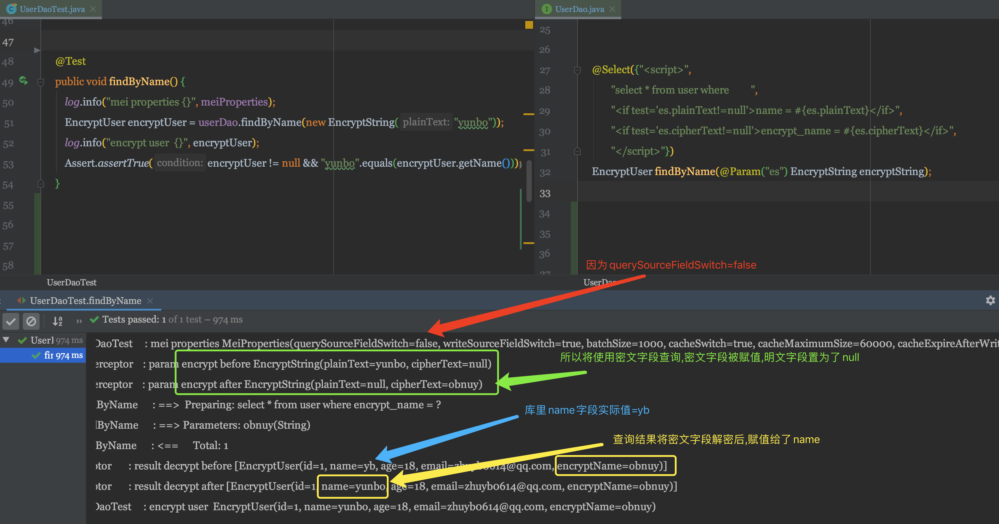
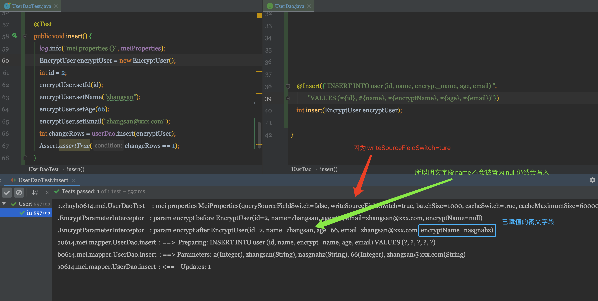

# mybatis-encrypt-interceptor
通过mybatis interceptor实现加解密
## 核心概念
### 明文字段
业务中使用,通过密文字段解密出的数据字段,需要是具体值.
### 密文字段
数据库中经过加密存储的字段.
## 处理流程详解
### 参数加密
通过EncryptParameterInterceptor对用户参数进行拦截,对明文字段加密.<br/>
如果配置不通过明文字段查询,会在查询前将明文字段置为null,查询后恢复.
如果配置了不再写入明文字段,会在执行写入前将明文字段置为null,写入后恢复.
### 响应结构解密
通过EncryptResultInterceptor对查询结果进行拦截,将密文字段解密.<br/>
单元测试演示<br/>



## 新上线业务
不需要清洗历史数据,可直接读写使用密文字段.
#### 配置
```yaml
mei:
  write-source-field-switch: false
  query-source-field-switch: false
```

## 已上线业务改造
数据库存在明文历史数据,需要分两次上线.
### 判断通过明文或密文字段查询
配置mei.query-source-field-switch=true时,不会对查询参数进行加密.<br/>
配置mei.query-source-field-switch=false时,会删除明文字段.<br/>
所以我们可以将sql就行为空判断,决定通过那个字段查询.<br/>
如
```java
    @Select({"<script>",
            "select * from user where         ",
            "<if test='es.plainText!=null'>name = #{es.plainText}</if>",
            "<if test='es.cipherText!=null'>encrypt_name = #{es.cipherText}</if>",
            "</script>"})
    EncryptUser findByName(@Param("es") EncryptString encryptString);
```
### 首次上线
仍需要查询仍使用明文字段.并同步写入密文字段.通过跑job将历史明文数据都写入密文数据.
#### 配置
```yaml
mei:
  write-source-field-switch: true
  query-source-field-switch: true
```
### 二次上线    
历史数据密文字段全部写入后,再二次上线切换至读写使用密文字段.
#### 配置
```yaml
mei:
  write-source-field-switch: false
  query-source-field-switch: false
```
### 清理数据
通过跑job,将明文字段数据删除

## 自定义扩展

### PrimitiveEncryptors接口
纯粹的基本类型(String,Long,Integer...)加解密提供接口,默认使用ReversePrimitiveEncryptors将字符串翻转.<br/>
用户可自定义实现PrimitiveEncryptors接口并注册Bean到spring容器后.将自动使用用户自定义加解密规则.<br/>
### TypeSupportEncryptors接口
默认提供EncryptClassEncryptors,用户将需要加解密的POJO,实现EncryptClass,并在密文字段通过@EncryptField注解关联明文字段.<br/>
如
```java
@Data
public class EncryptUser implements EncryptClass {
    private Integer id;
    private String name;
    private Integer age;
    private String email;
    @EncryptField(sourceFiledName = "name")
    private String encryptName;
}
```
用户可自定义实现TypeSupportEncryptors接口,对指定Class进行处理<br/>
如
```java
@Component
public class UserAuthEncryptors implements TypeSupportEncryptors<UserAuth> {

    @Override
    public void encrypt(UserAuth parameterObject, boolean isRemoveSource) {
        parameterObject.setEncryptIdentityNo(Base64Utils.encodeToString(parameterObject.getIdentityNo().getBytes()));
        if (isRemoveSource) {
            parameterObject.setIdentityNo(null);
        }
    }

    @Override
    public void encryptBatch(List<UserAuth> parameterObject, boolean isRemoveSource) {
        for (UserAuth userAuth : parameterObject) {
            encrypt(userAuth, isRemoveSource);
        }
    }

    @Override
    public void decrypt(UserAuth resultObject) {
        resultObject.setIdentityNo(new String(Base64Utils.decodeFromString(resultObject.getEncryptIdentityNo())));
    }

    @Override
    public void decryptBatch(List<UserAuth> resultObject) {
        for (UserAuth userAuth : resultObject) {
            decrypt(userAuth);
        }
    }

    @Override
    public Class<UserAuth> support() {
        return UserAuth.class;
    }
}
```
## 缓存支持
通过GuavaCache对单个数据的加解密进行缓存.可用过配置关闭.

## 单字段查询判断
需要手动判断当前是要查明文字段还是查密文字段,比如只通过用户名查询,参数只是一个String<br/>
可以通过QueryCipherTextFieldSwitch.isQueryByCipherTextField()方法判断,true表示应该通过密文查询,false表示应该通过明文字段查询

## 配置说明
```json
{
  "groups": [
    {
      "name": "mei",
      "type": "com.github.zhuyb0614.mei.MeiProperties",
      "sourceType": "com.github.zhuyb0614.mei.MeiProperties"
    }
  ],
  "properties": [
    {
      "name": "mei.batch-size",
      "type": "java.lang.Integer",
      "description": "批量加解密的单批数据量，最大为1000。超过1000将使用1000",
      "sourceType": "com.github.zhuyb0614.mei.MeiProperties",
      "defaultValue": 1000
    },
    {
      "name": "mei.cache-expire-after-write-seconds",
      "type": "java.lang.Integer",
      "description": "缓存过期时间",
      "sourceType": "com.github.zhuyb0614.mei.MeiProperties",
      "defaultValue": 3600
    },
    {
      "name": "mei.cache-maximum-size",
      "type": "java.lang.Integer",
      "description": "缓存最大数据量",
      "sourceType": "com.github.zhuyb0614.mei.MeiProperties",
      "defaultValue": 60000
    },
    {
      "name": "mei.cache-switch",
      "type": "java.lang.Boolean",
      "description": "是否开启缓存",
      "sourceType": "com.github.zhuyb0614.mei.MeiProperties",
      "defaultValue": true
    },
    {
      "name": "mei.query-source-field-switch",
      "type": "java.lang.Boolean",
      "description": "查询明文列开关",
      "sourceType": "com.github.zhuyb0614.mei.MeiProperties",
      "defaultValue": true
    },
    {
      "name": "mei.write-source-field-switch",
      "type": "java.lang.Boolean",
      "description": "是否写入明文字段开关",
      "sourceType": "com.github.zhuyb0614.mei.MeiProperties",
      "defaultValue": true
    }
  ],
  "hints": []
}
```
